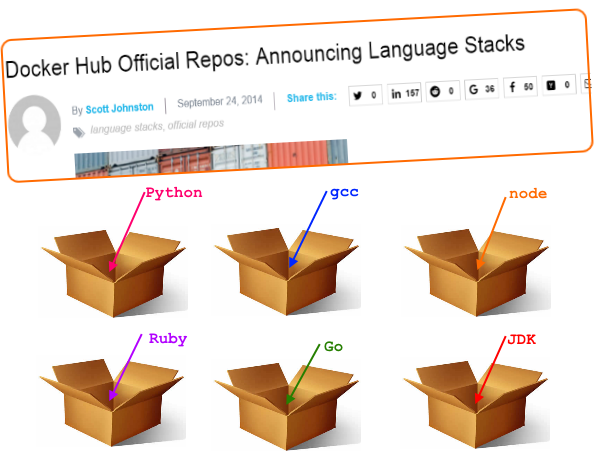

name: inverse
layout: true
class: center, middle, inverse
---
layout: false
class: center
<br><br><br><br><br><br>
# 5 conteneurs pour 5 langages
<br><br><br>


<!-- #.left[] -->

---
layout: false
.left-column[
  ## Agenda
]
.right-column[

1. Des conteneurs pour mieux développer

2. 5 conteneurs pour 5 langages
  - Swift
  - Rust
  - Haskell
  - Go
  - JShell
  - [ArnoldC]

3. Conclusions
]
---
template: inverse

## Hello

---

.large[
.left[Mario........................................]
.left[CTO @ Zenika Paris.................]
.left[Formateur officiel Docker.....]

.left[[@mariolet](https://twitter.com/mariolet)................................]
.left[[l0rd](https://github.com/l0rd)...........................................]
]

---

template: inverse

## Des conteneurs pour mieux développer

---

.left-column[
  ## Mieux développer
]
.right-column[
<br><br>
Il nous arrive parfois d'être frustrés
<br><br>

]

---

.left-column[
  ## Mieux développer
  ### Temps
]
.right-column[
<br><br>
**Besoin n.1**

Réduire le temps de mise en place d'un environnement de développement


]

---

.left-column[
  ## Mieux développer
  ### Temps
  ### Cohérence
]
.right-column[
<br><br>
**Besoin n.2**

Avoir des environnement cohérents


]

---

.left-column[
  ## Mieux développer
  ### Temps
  ### Cohérence
  ### Docker Language Stacks
]
.right-column[



]

---

.left-column[
  ## Mieux développer
  ### Temps
  ### Cohérence
  ### Docker Language Stacks
  ### Un exemple
]
.right-column[
<br>
Build et run de 27 Hello World en 27 langages en quelques secondes
<br>


]

---

template: inverse

## 5 conteneurs pour 5 langages

---

.left-column[
  ## 1. Swift
]
.right-column[
<br><br>

]

---

.left-column[
  ## 1. Swift
  ### Le langage
]
.right-column[

<br><br>
- Développé par Apple

- La première version a été pubbliée en 2014

- Open Source depuis novembre 2015 pour iOS, OS X, Linux et FreeBSD

- Influencé par Objective-C, Rust, Haskell, Ruby, Python, C#

- Multi-paradigme : OO et functionnel

- Typage statique, fort et inféré

- Langage plus aimé dans le classement StackOverflow 2015
]

---

.left-column[
  ## 1. Swift
  ### Le langage
  ### Le conteneur
]
.right-column[

<br><br>
- Image: `swiftdocker/swift`

- Pattern: *Sources in the volume*

- Build/run commands

```bash
docker run --rm \
    -v $(pwd):/src/ \
    <image> \
    <command>
```
]

---

.left-column[
  ## 1. Swift
  ### Le langage
  ### Le conteneur
  ### Cheat Sheet
]
.right-column[
```swift
// Hello World
print("Hello World")


// Build et Execution d'une application
swift hello.swift

// Avec Docker
docker run --rm \
    -v $(pwd):/src/ \
    swiftdocker/swift \
    swift /src/hello.swift

// Declaration d'une fonction
func factorial(n: Int) -> Int {
	do something....
	return i
}


// Condition if
if val == 0 {
  // Some code here
} else if val == 1 {
  // Some code here
}


// Boocle for in
for num in 1...100 {//iterate from 1 to 100}
```
]

---

.left-column[
  ## 2. Rust
]
.right-column[
<br><br><br><br>

]

---

.left-column[
  ## 2. Rust
  ### Le langage
]
.right-column[

<br><br>
- Développé par Apple

- La première version a été pubbliée en 2014

- Open Source depuis novembre 2015 pour iOS, OS X, Linux et FreeBSD

- Influencé par Objective-C, Rust, Haskell, Ruby, Python, C#

- Multi-paradigme : OO et functionnel

- Typage statique, fort et inféré

- Langage plus aimé dans le classement StackOverflow 2015
]

---

.left-column[
  ## 2. Rust
  ### Le langage
  ### Le conteneur
]
.right-column[

<br><br>
- Image: `swiftdocker/swift`

- Pattern: *Sources in the volume*

- Build/run commands

```bash
docker run --rm \
    -v $(pwd):/src/ \
    <image> \
    <command>
```
]

---

.left-column[
  ## 2. Rust
  ### Le langage
  ### Le conteneur
  ### Cheat Sheet
]
.right-column[
```swift
// Hello World
print("Hello World")


// Build et Execution d'une application
swift hello.swift

// Avec Docker
docker run --rm \
    -v $(pwd):/src/ \
    swiftdocker/swift \
    swift /src/hello.swift

// Declaration d'une fonction
func factorial(n: Int) -> Int {
	do something....
	return i
}


// Condition if
if val == 0 {
  // Some code here
} else if val == 1 {
  // Some code here
}


// Boocle for in
for num in 1...100 {//iterate from 1 to 100}
```
]

---

template: inverse

## merci
[mario.loriedo@zenika.com]

[@mariolet]
