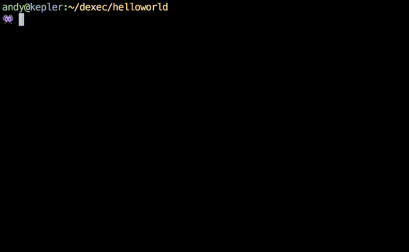

name: inverse
layout: true
class: center, middle, inverse
---
layout: false
class: center
<br><br><br><br><br><br>
# 5 conteneurs pour 5 langages
<br><br><br>


<!-- #.left[] -->

---
template: inverse

## Hello

---

.large[
.left[Mario........................................]
.left[CTO @ Zenika Paris.................]
.left[Formateur officiel Docker.....]

.left[[@mariolet](https://twitter.com/mariolet)................................]
.left[[l0rd](https://github.com/l0rd)...........................................]
]

---
layout: false
.left-column[
  ## Agenda
]
.right-column[
<br>
1. Des conteneurs pour (mieux) développer

2. FizzBuzz

3. 5 conteneurs pour 5 langages
  - Swift
  - Rust
  - Haskell
  - Go
  - JShell

4. Conclusions
]
---

template: inverse

## Des conteneurs pour (mieux) développer

---

.left-column[
  ## Mieux développer
]
.right-column[
<br><br>
Il nous arrive parfois d'être frustrés
<br><br>

]

---

.left-column[
  ## Mieux développer
  ### Temps
]
.right-column[
<br><br>
**Besoin n.1**

Réduire le temps de mise en place d'un environnement de développement


]

---

.left-column[
  ## Mieux développer
  ### Temps
  ### Cohérence
]
.right-column[
<br><br>
**Besoin n.2**

Avoir des environnement cohérents


]

---

.left-column[
  ## Mieux développer
  ### Temps
  ### Cohérence
  ### Docker Language Stacks
]
.right-column[


]

---

.left-column[
  ## Mieux développer
  ### Temps
  ### Cohérence
  ### Docker Language Stacks
  ### Un exemple
]
.right-column[
<br>
Build et run de 27 Hello World en 27 langages en quelques secondes
<br>


]

---

template: inverse

## FizzBuzz

---

.left-column[
  ## FizzBuzz
  ###
]
.right-column[
<br><br>

]


---

template: inverse

## 5 conteneurs pour 5 langages

---

.left-column[
  ## 1. Swift
]
.right-column[
<br><br>

]

---

.left-column[
  ## 1. Swift
  ### Le langage
]
.right-column[

<br><br>
- Développé par Apple

- La première version a été pubbliée en 2014

- Open Source depuis novembre 2015 pour iOS, OS X, Linux et FreeBSD

- Influencé par Objective-C, Rust, Haskell, Ruby, Python, C#

- Multi-paradigme : OO et functionnel

- Typage statique, fort et inféré

- Langage plus aimé dans le classement StackOverflow 2015
]

---

.left-column[
  ## 1. Swift
  ### Le langage
  ### Le conteneur
]
.right-column[

<br><br>
- Image: `swiftdocker/swift`

- Pattern: **Les sources sont partagées dans un volume**

- Build/run commands

```bash
docker run --rm \
    -v $(pwd):/src/ \
    <image> \
    <command>
```
]

---

.left-column[
  ## 1. Swift
  ### Le langage
  ### Le conteneur
  ### Cheat Sheet
]
.right-column[
```swift
// Hello World
print("Hello World")


// Build et Execution d'une application
swift hello.swift

// Avec Docker
docker run --rm \
    -v $(pwd):/src/ \
    swiftdocker/swift \
    swift /src/hello.swift

// Declaration d'une fonction
func factorial(n: Int) -> Int {
	do something....
	return i
}


// Condition if
if val == 0 {
  // Some code here
} else if val == 1 {
  // Some code here
}


// Boocle for in
for num in 1...100 {//iterate from 1 to 100}
```
]

---

.left-column[
## 2. Rust
]
.right-column[
<br><br><br><br>

]

---

.left-column[
  ## 2. Rust
  ### Le langage
]
.right-column[

<br><br>
- Développé par

- La première version a été pubbliée en

- Open Source ?

- Influencé par

- Paradigme :

- Typage

- Le `;` est utilisé pour différentier expressions et instructions :
`x + 1 // this is an expression: it returns a value`
`x + 1; // this is a statement: it does not return a value`
]

---

.left-column[
  ## 2. Rust
  ### Le langage
  ### Le conteneur
]
.right-column[

<br><br>
- Image: `mariolet/rust`

- Pattern: **Les sources sont inclus dans l'image** / **Le build docker build les sources** / **variant onbuild**

- Build/run commands

```bash
docker build -t <image-name> <dockerfile-path>
docker run <image-name>
```
]

---

.left-column[
  ## 2. Rust
  ### Le langage
  ### Le conteneur
  ### Cheat Sheet
]
.right-column[
```rust
// Hello World
fn main() {
    println!("Hello World!");
}


// Build et Execution d'une application
rustc hello.rs
./hello

// Avec Docker
// docker build -t hellorust .
// docker run hellorust


// Declaration d'une fonction
fn factorial(n: i32) -> i32 {
	do something....
	i // do not use `;` to return a value
}


// Condition if
if val == 0 {
  // Some code here
} else if val == 1 {
  // Some code here
}

// Boucle for in
for num in 1...101 {//iterate from 1 to 100}
```
]

---

.left-column[
## 3. Haskell
]
.right-column[
<br><br><br><br>

]

---

.left-column[
  ## 3. Haskell
  ### Le langage
]
.right-column[

<br><br>
- Développé par

- La première version a été pubbliée en

- Open Source ?

- Influencé par

- Paradigme :

- Typage

- L'indentation est significative (**layout** vs `;`+`{}`)
```haskell
if x == 4
              then putStrLn "You're right!"
              else putStrLn "You're wrong!"
```
- Pas besoin de parenthèses pour invoquer une fonction
`factorial 5`

- Les fonctions peuvent être déclarée de façon récursive
```haskell
factorial 1 = 1
factorial n = n * factorial (n-1)
```
]

---

.left-column[
  ## 3. Haskell
  ### Le langage
  ### Le conteneur
]
.right-column[

<br><br>
- Image: `haskell` (image officielle)

- Pattern: **exec all the things**

- Build/run commands

```bash
docker run -d --name <container-name> \
           -v $(pwd):/src/ \
           <image-name> tail -f /dev/null
docker exec <container-name> <build-command>
docker exec <container-name> <run-command>
```
]

---

.left-column[
  ## 3. Haskell
  ### Le langage
  ### Le conteneur
  ### Cheat Sheet
]
.right-column[
```haskell
-- Hello World
main = putStrLn "Hello, World!"

-- Build et Execution d'une application
-- ghc -o hello hello.hs
-- ./hello

-- Avec Docker
-- docker run --name haskell -d -v $(pwd):/src/ haskell \
--            tail -f /dev/null
-- docker exec haskell ghc -o hello /src/hello.hs
-- docker exec haskell ./hello

-- Declaration d'une fonction
factorial n =
  -- do something ...
  i

-- Condition if
if val == 0
  then
    -- Some code here
  else if val == 1
    then
      -- Some code here

-- On utilise la récursion pour faire des boucles
printStringNTimes 0 = return ()
printStringNTimes n =
  do
   -- Do Something
   printStringNTimes (n-1)
```

]

---

.left-column[
## 4. Go
]
.right-column[
<br><br><br><br>

]

---

.left-column[
  ## 4. Go
  ### Le langage
]
.right-column[

<br><br>
- Développé par

- La première version a été pubbliée en

- Open Source ?

- Influencé par

- Paradigme :

- Typage

- Autres curiositées
]

---

.left-column[
  ## 4. Go
  ### Le langage
  ### Le conteneur
]
.right-column[

<br><br>
- Image: `scratch` (image officielle)

- Pattern: **Le conteneur comme Runtime Environment**

- Build/run commands

```bash
# Cette fois-ci, pour builder, nous n'utiliserons pas un conteneur
CGO_ENABLED=0 GOOS=linux go build \
      -a -installsuffix cgo <source-file>
# En revanche on utilisera bien un conteneur pour
# éxécuter notre application
docker build -t <image-name> .
docker run <image-name>
```
]

---

.left-column[
  ## 4. Go
  ### Le langage
  ### Le conteneur
  ### Cheat Sheet
]
.right-column[
```go
// Hello World
package main
import "fmt"
func main() {
	fmt.Println("Hello, World!")
}

// Build et Execution d'une application
// go build hello.go && ./hello (mais aussi go run hello.go)

// Avec Docker
// CGO_ENABLED=0 GOOS=linux go build -a \
//             -installsuffix cgo hello.go
// docker build -t hellogo .
// docker run -d hellogo -p 9090:9090

// Declaration d'une fonction
func factorial(n int) int {
	do something....
	return i
}

// Condition if
if val == 0 {
  // Some code here
} else if val == 1 {
  // Some code here
}

// Boucle for
for i := 1; i < 101; i++  {
  //iterate from 1 to 100
}
```
]

---

.left-column[
## 5. JShell
]
.right-column[
<br><br><br><br>

]

---

.left-column[
  ## 5. JShell
  ### Le langage
]
.right-column[

<br><br>
- Développé par Oracle (JEP 222)

- Fait partie de OpenJDK 9, sera livré avec la JDK 9

- Influencé par les REPL (read-eval-print-loop) d'autres langages comme Scala, Ruby, JavaScript, Haskell, Clojure et Python

- C'est du Java donc OOP, statique, fortement typé

- Pas besoin de définir une classe et un main pour executer du code

- Les *snippets* peuvent référencer des variables, méthodes ou classes qui ne sont pas définis

- Au start-up un certain nombre de librairies sont importés automatiquement (`/imports`) et des méthodes sont prédéfinies (`/methods`)
]

---

.left-column[
  ## 5. JShell
  ### Le langage
  ### Le conteneur
]
.right-column[

<br><br>
- Image: `java:9-jdk` (image officielle)

- Pattern: **Conteneur executable**

- Build/run commands

```bash
alias <exec-name>=docker run -ti --rm <image-name> <command>
```
]

---

.left-column[
  ## 5. JShell
  ### Le langage
  ### Le conteneur
  ### Cheat Sheet
]
.right-column[

```bash
# 'Installation' de la JShell
alias jshell=docker run -ti --rm \
                      java:9-jdk \
                      jshell

# Execution de la JShell
jshell

# Pour sortir
-> /exit
```

```java
// Hello World (pas besoin de main, ni de `;`)
printf("Hello, World")

// Declaration d'une fonction
int factorial(int n) {
	// do something....
	return i;
}

// Condition if
if (val == 0) {
  // Some code here
} else if (val == 1) {
  // Some code here
}


// Boucle for in
for (int i = 1; i <= 100; i++) {
  // do something
}
```
]

---

.left-column[
## 6. ArnoldC
]
.right-column[
<br><br><br><br>

]

---

.left-column[
  ## 6. ArnoldC
  ### Le langage
]
.right-column[

<br><br>
- Développé par

- La première version a été pubbliée en

- Open Source ?

- Influencé par

- Paradigme : impératif

- Typage

- Autres curiositées
]

---

.left-column[
  ## 6. ArnoldC
  ### Le langage
  ### Le conteneur
]
.right-column[

<br><br>
- Image: `mariolet/arnoldc`

- Pattern: **Les sources sont partagées dans un volume**

- Build/run commands

```bash
docker run --rm \
    -v $(pwd):/src/ \
    <image> \
    <command>
```
]

---

.left-column[
  ## 6. ArnoldC
  ### Le langage
  ### Le conteneur
  ### Cheat Sheet
]
.right-column[
```
// Hello World
IT'S SHOWTIME
TALK TO THE HAND "Hello, World"
YOU HAVE BEEN TERMINATED

// Build et Execution d'une application
rustc hello.rs
./hello

// Avec Docker
// docker build -t hellorust .
// docker run hellorust


// Declaration d'une fonction
fn factorial(n: i32) -> i32 {
	do something....
	i
}


// Condition if
if val == 0 {
  // Some code here
} else if val == 1 {
  // Some code here
}

BECAUSE I'M GOING TO SAY PLEASE value
[statements]
BULLSHIT
[statements]
YOU HAVE NO RESPECT FOR LOGIC


// Boucle for in
for num in 1...100 {//iterate from 1 to 100}
```
]

---

## Resources

- [The Rust Programming Language Book](https://doc.rust-lang.org/stable/book/)

- [Haskell wiki list of Haskell tutorials](https://wiki.haskell.org/Tutorials)

- [A tour of Go](https://tour.golang.org/)

- [JEP 222: jshell: The Java Shell (Read-Eval-Print Loop)](http://openjdk.java.net/jeps/222)

- [ArnoldC sur GitHub](https://github.com/lhartikk/ArnoldC/wiki/ArnoldC)

---

template: inverse

## merci

http://l0rd.github.io/talks/containers-and-languages

[@mariolet]
